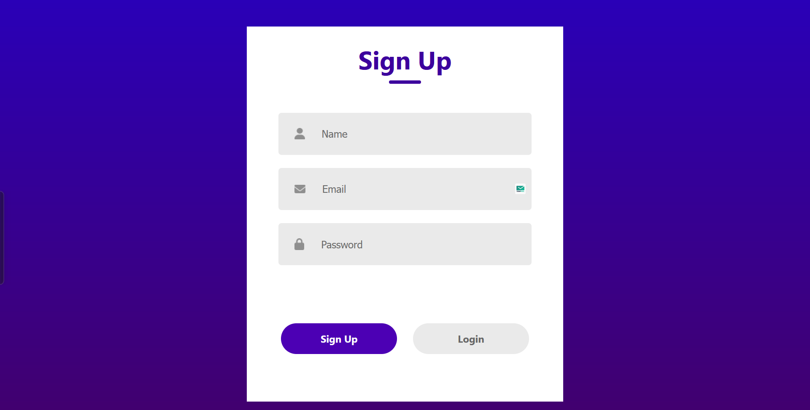

<div align="center">

# 🔐 React Login & Signup Page

### **[LIVE DEMO](https://login-signup-page-sainath.vercel.app/)**



</div>

## 🌟 About The Project

A sleek and modern authentication interface built with React, featuring a seamless toggle between login and signup modes. The application showcases modern UI/UX principles with a focus on user experience and responsive design.

## ✨ Features

- **Intuitive Mode Switching**: Toggle effortlessly between Login and Signup
- **Responsive Design**: Perfect experience on all devices
- **Form Validation**: Real-time validation for all input fields
- **Modern UI Elements**: Clean design with subtle animations
- **Password Recovery**: Integrated "Forgot Password" functionality
- **Secure Authentication Flow**: Industry-standard authentication patterns

## 🛠️ Built With

-  React 19
-  Custom styling
-  ES6+

## 🚀 Getting Started

### Prerequisites

- Node.js (v14 or higher)
- npm or yarn

### Quick Start

```bash
# Clone the repository
git clone https://github.com/sainath-666/login_signup_page.git

# Navigate to project directory
cd login_signup_page

# Install dependencies
npm install

# Start development server
npm start
```

Open [http://localhost:3000](http://localhost:3000) to view it in your browser.

## 📱 User Interface

The application features a clean, minimalist interface with:

- Animated transitions between login and signup modes
- Custom form inputs with validation
- Responsive design that works on mobile, tablet, and desktop
- Intuitive user flow with clear call-to-action buttons

## 📂 Project Structure

```
src/
├── Components/
│   ├── Assets/         # Icons and images
│   └── LoginSignup/    # Login/Signup component
│       ├── LoginSignup.jsx
│       └── LoginSignup.css
├── App.js              # Main application component
└── index.js            # Entry point
```

## 🔧 Available Scripts

- `npm start` - Runs the app in development mode
- `npm test` - Launches the test runner
- `npm run build` - Builds the app for production
- `npm run eject` - Ejects from Create React App

## 🤝 Connect With Me

[](https://www.linkedin.com/in/sainath666)

---

<div align="center">
  <p>Made with ❤️ by Sainathreddy</p>
</div>
